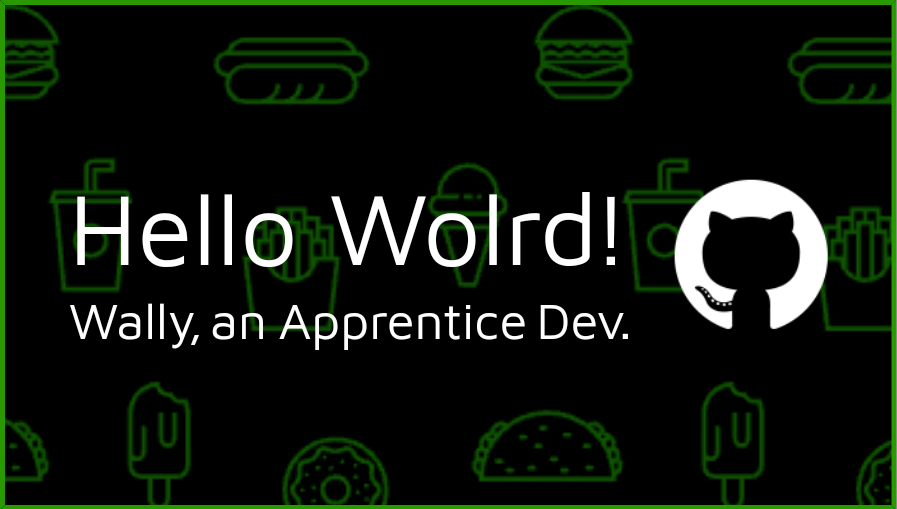

# 👋 Olá, Mundo! Eu sou o [Wall-E! Só para os mais íntimos!] 🌍

## 👨‍💻 Sobre Mim

Sou um **dev iniciante** em uma jornada 🚀 para dominar a arte de programar! Apaixonado por tecnologia e sempre buscando aprender algo novo. Aqui você encontrará alguns dos meus projetos e contribuições para o mundo open-source.

## 🔧 Habilidades

- **Linguagens:**
  - Python 🐍
  - JavaScript ☕
  - HTML & CSS 🌐
  - TypeScript

- **Ferramentas e Tecnologias:**
  - Git & GitHub 🧑‍💻
  - Flask 🥂
  - Bootstrap 👢
  - Vite

## 🚧 Projetos em Andamento

- **EcoScan - projeto de tcc** 🌐: Um site-app simples de scan de reciclaveis.

## 📚 Aprendendo Atualmente

- React ⚛️
- Node.js 🌳

## 📫 Como me Encontrar

- **Email:** [fernandeswallyson5@gmail.com](mailto:fernandeswallyson5@gmail.com)

## 🌟 Curiosidades

- 🎮 Amo jogar videogames nas horas vagas.
- 📖 Leitor ávido de livros de poesia
- 🎨 Tentando aprender a desenhar (um dia chego lá!).

## 🚀 Vamos Codar Juntos!

Sempre aberto a colaborações e novas amizades na comunidade de desenvolvimento! Sinta-se à vontade para explorar meus repositórios e me chamar para um papo. Vamos transformar **ideias** em **código**!

---

> "Falar é fácil. Mostre-me o código." - Linus Torvalds
